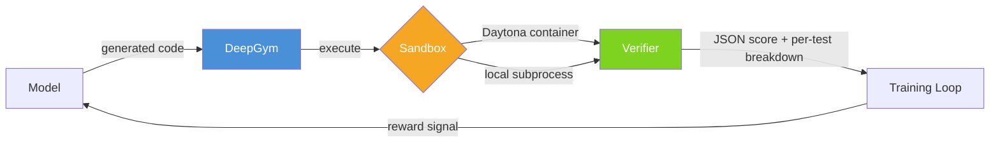
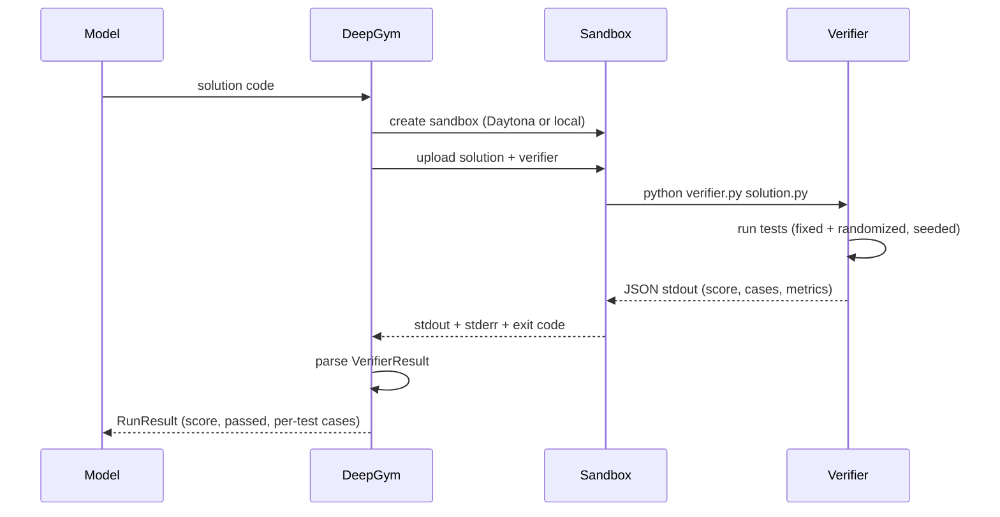
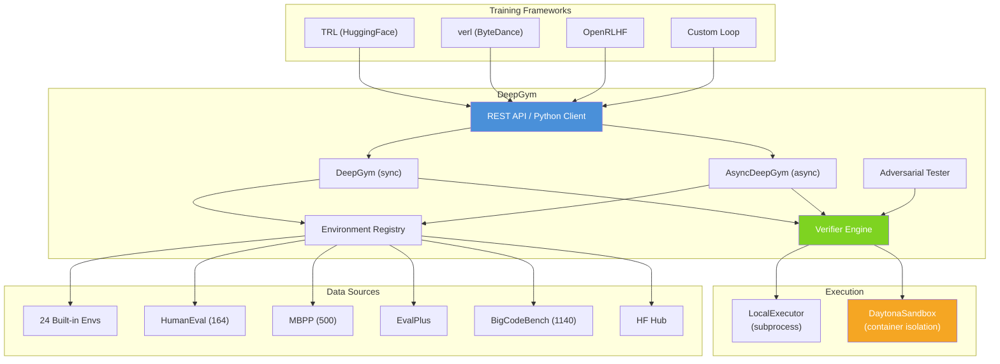

<p align="center">
  <h1 align="center">DeepGym</h1>
  <p align="center">Reward signals for RL code training. Sandbox it, verify it, score it.</p>
</p>

<p align="center">
  <a href="https://pypi.org/project/deepgym/"></a>
  <a href="https://pypi.org/project/deepgym/"></a>
  <a href="https://github.com/DeepGym/deepgym/blob/main/LICENSE"></a>
  <a href="https://github.com/DeepGym/deepgym/wiki"></a>
</p>

---

Your model writes code. DeepGym runs it in a sandbox, checks it against a verifier, and gives you back a score between 0 and 1. Plug that into TRL, verl, OpenRLHF -- whatever you're using for GRPO/DAPO/PPO.



## Install

```bash
pip install deepgym
```

<details>
<summary>More install options</summary>

```bash
# With Daytona sandbox support
pip install deepgym[daytona]

# With HuggingFace Hub integration
pip install deepgym[hf]

# With lm-evaluation-harness
pip install deepgym[lm-eval]

# Everything (dev + daytona + hf + lm-eval)
pip install deepgym[all]

# From source
git clone https://github.com/DeepGym/deepgym.git
cd deepgym
pip install -e ".[all]"
```

</details>

## Quick Start

```python
from deepgym import DeepGym, load_environment

dg = DeepGym(mode='local')
env = load_environment('coin_change')

solution = '''
def coin_change(coins, amount):
    dp = [float('inf')] * (amount + 1)
    dp[0] = 0
    for coin in coins:
        for x in range(coin, amount + 1):
            dp[x] = min(dp[x], dp[x - coin] + 1)
    return dp[amount] if dp[amount] != float('inf') else -1
'''

result = dg.run(env, model_output=solution)
print(result.score)    # 1.0
print(result.passed)   # True
print(result.cases)    # per-test breakdown: which tests passed, which failed
```

## How it works



The verifier spits out JSON: a score from 0.0 to 1.0, pass/fail, and (optionally) a per-test-case breakdown so you can see exactly which tests passed and which didn't. That's a much denser training signal than binary pass/fail.

## What you get

- **24 built-in coding environments** (easy/medium/hard) plus 2 computer-use and 2 tool-use
- **2,350+ importable benchmarks** -- HumanEval, MBPP, EvalPlus, BigCodeBench
- **Per-test rewards** -- not just pass/fail, you see which tests broke and can shape rewards from that
- **Deterministic scoring** -- seeded verifiers, same input same score, every time (GRPO needs this)
- **Three runtime modes** -- `local` (subprocess), `daytona` (container isolation), `auto` (tries Daytona, falls back)
- **Drop-in integrations** -- TRL, verl, OpenRLHF reward functions, lm-eval task adapter, HF Hub
- **Batch scoring** -- score N completions in parallel with `run_batch()`
- **Gymnasium API** -- `reset()` / `step()` if that's what you prefer
- **Reward hack detection** -- adversarial testing with 6 attack strategies
- **REST API** -- FastAPI server with async jobs and API key auth

## Usage

### Score a single solution

```python
from deepgym import DeepGym, load_environment

dg = DeepGym(mode='local')
env = load_environment('two_sum')

result = dg.run(env, model_output='def two_sum(nums, target): ...')
print(result.score)              # 0.85
print(result.passed)             # False
print(result.reward_components)  # {'correctness': 0.85, 'efficiency': 0.9}
```

### Batch scoring for GRPO

Generate N completions, score them all, compute advantages:

```python
solutions = [model.generate(prompt) for _ in range(8)]
batch = dg.run_batch(env, solutions, max_parallel=8)

scores = [r.score for r in batch.results]
mean = sum(scores) / len(scores)
std = (sum((s - mean) ** 2 for s in scores) / len(scores)) ** 0.5
advantages = [(s - mean) / (std + 1e-8) for s in scores]
```

### TRL

```python
from deepgym.integrations.trl import make_trl_reward_fn
from trl import GRPOTrainer

reward_fn = make_trl_reward_fn(env)
trainer = GRPOTrainer(model=model, reward_funcs=[reward_fn])
trainer.train()
```

### verl

```python
from deepgym.integrations.verl import make_verl_compute_score

compute_score = make_verl_compute_score(env)
# In verl config: custom_reward_function.path = "your_reward_module.py"
```

### OpenRLHF

```python
from fastapi import FastAPI
from deepgym.integrations.openrlhf import create_openrlhf_router

app = FastAPI()
app.include_router(create_openrlhf_router(env, dg))
# uvicorn app:app --port 8000
# POST /reward/score {"prompts": [...], "outputs": [...]} -> {"rewards": [...]}
```

### lm-evaluation-harness

```bash
python -c "from deepgym.integrations.lm_eval import register_deepgym_tasks; register_deepgym_tasks()"

lm_eval --model hf \
  --model_args pretrained=Qwen/Qwen2-0.5B-Instruct \
  --tasks deepgym_coin_change,deepgym_two_sum
```

### HuggingFace Hub

```python
from deepgym.integrations.hf import push_environment_to_hub, load_environment_from_hub

push_environment_to_hub(env, repo_id='your-org/deepgym-coin-change', env_name='coin_change')

# load from anywhere
env = load_environment_from_hub('your-org/deepgym-coin-change')
```

## Advanced Examples

### Custom verifiers

Write your own verifier inline. The string becomes the body of a function that gets `(solution_path, test_cases_path=None)`. Return a float, bool, or dict -- the wrapper normalizes it to JSON.

```python
from deepgym import DeepGym, Environment

dg = DeepGym(mode='local')
env = Environment(
    task='Write a function `add(a, b)` that returns the sum of two numbers.',
    verifier_code=(
        'import importlib.util\n'
        'spec = importlib.util.spec_from_file_location("sol", solution_path)\n'
        'mod = importlib.util.module_from_spec(spec)\n'
        'spec.loader.exec_module(mod)\n'
        'cases = [(2, 3, 5), (0, 0, 0), (-1, 1, 0), (100, 200, 300)]\n'
        'passed = sum(1 for a, b, exp in cases if mod.add(a, b) == exp)\n'
        'return passed / len(cases)\n'
    ),
)

result = dg.run(env, model_output='def add(a, b):\n    return a + b\n')
# score: 1.0, passed: True
```

### Per-test reward shaping

Instead of just a single number, you get scores for each individual test case. Useful for denser training signals.

```python
result = dg.run(env, model_output=solution)

for case in result.cases:
    print(f"{case.id}: {'PASS' if case.passed else 'FAIL'} "
          f"(input: {case.input_summary}, expected: {case.expected_summary})")

# or through the reward function
from deepgym.integrations.reward import RewardFunction
reward_fn = RewardFunction(env, max_parallel=8)

per_test = reward_fn.per_test_rewards(solutions)
# [{'test_0': 1.0, 'test_1': 0.0, 'test_2': 1.0, 'overall': 0.67}, ...]

shaped = reward_fn.shaped_rewards(solutions)
# [{'correctness': 0.8, 'efficiency': 0.9}, ...]
```

### Async batch processing

When you need throughput, use the async client:

```python
import asyncio
from deepgym import AsyncDeepGym, load_environment

async def score_all():
    dg = AsyncDeepGym(mode='daytona')
    envs = ['coin_change', 'two_sum', 'climbing_stairs']

    tasks = [
        dg.run(load_environment(name), solutions[name])
        for name in envs
    ]
    results = await asyncio.gather(*tasks, return_exceptions=True)

    for name, result in zip(envs, results):
        if isinstance(result, Exception):
            print(f'{name}: ERROR')
        else:
            print(f'{name}: {result.score:.2f}')

asyncio.run(score_all())
```

### Gymnasium-style API

```python
from deepgym.gym import DeepGymEnv

gym_env = DeepGymEnv(environment=env, max_steps=3)
obs = gym_env.reset()
obs, reward, done, info = gym_env.step('def coin_change(coins, amount): ...')
```

### Audit verifiers for reward hacking

Before you burn GPU hours training against a verifier, check that it can't be gamed:

```python
from deepgym.adversarial import AdversarialTester

tester = AdversarialTester(dg, pass_threshold=0.5)
report = tester.test(env, strategies=['empty', 'hardcoded', 'trivial', 'overflow'])

print(f'Exploits found: {report.exploits_found}/{report.attacks_run}')
print(f'Robust: {report.is_robust}')
```

```bash
deepgym audit --verifier verifier.py --task "..." --strategies empty hardcoded trivial
```

## Environments

### Built-in (24)

**Coding (20):**
| Difficulty | Environments |
|-----------|-------------|
| Easy | `fizzbuzz`, `reverse_string`, `palindrome_check`, `anagram_check`, `valid_parentheses`, `python_sorting`, `string_manipulation`, `two_sum` |
| Medium | `coin_change`, `climbing_stairs`, `house_robber`, `rotate_array`, `remove_duplicates`, `max_subarray`, `roman_to_integer`, `matrix_spiral`, `longest_consecutive`, `group_anagrams`, `top_k_frequent`, `merge_intervals`, `binary_search` |
| Hard | `longest_common_subsequence`, `level_order_traversal` |

**Computer-use (2):** `file_organizer`, `cli_task`

**Tool-use (2):** `api_request`, `data_pipeline`

### Importable benchmarks (2,350+)

```bash
python scripts/import_humaneval.py      # 164 problems
python scripts/import_mbpp.py           # 500 problems
python scripts/import_evalplus.py       # HumanEval+ (80x more tests) + MBPP+
python scripts/import_bigcodebench.py   # 1,140 problems
```

## Verifier protocol

Verifiers write JSON to stdout:

```json
{
  "schema_version": "1.0",
  "score": 0.85,
  "passed": true,
  "details": "12/14 tests passed",
  "cases": [
    {"id": "test_0", "passed": true, "score": 1.0, "input_summary": "coins=[1,2,5] amount=11"},
    {"id": "test_1", "passed": false, "score": 0.0, "error": "expected 3, got -1"}
  ],
  "reward_components": {"correctness": 0.85, "efficiency": 0.92},
  "seed": 42
}
```

The `cases` field is the interesting part. Your training loop gets per-test granularity instead of a single 0 or 1. Simple verifiers that return a float or bool get auto-wrapped to this format. Full spec in the [wiki](https://github.com/DeepGym/deepgym/wiki/Verifier-Protocol).

## Architecture



Three modes: **local** (subprocess, no deps, no isolation), **daytona** (container isolation), **auto** (tries Daytona, falls back to local). Use local for dev, Daytona for anything untrusted.

## CLI

```bash
# Run one environment
deepgym run --task task.md --verifier verifier.py --solution solution.py

# Batch eval
deepgym eval --suite medium --solutions-dir ./solutions/ --max-parallel 100

# Audit a verifier
deepgym audit --verifier verifier.py --task "..." --strategies empty hardcoded trivial

# API server (dev)
DEEPGYM_NO_AUTH=true deepgym serve --host 127.0.0.1 --port 8000 --allow-local-exec

# API server (production)
DEEPGYM_API_KEY=your-key DAYTONA_API_KEY=your-key deepgym serve --port 8000
```

## Daytona setup

<details>
<summary>Self-hosted (local Docker)</summary>

```bash
git clone https://github.com/daytonaio/daytona
cd daytona
docker compose -f docker/docker-compose.yaml up -d
# Dashboard: http://localhost:3000 (dev@daytona.io / password)
```

```bash
export DAYTONA_API_URL=http://localhost:3000
export DAYTONA_API_KEY=your-local-key
```

</details>

<details>
<summary>Daytona Cloud</summary>

1. Sign up at [app.daytona.io](https://app.daytona.io)
2. Grab your API key from the dashboard

```bash
export DAYTONA_API_KEY=your-cloud-key
```

</details>

## Development

```bash
pip install -e ".[all]"
pytest                      # 227 tests
ruff check src/             # lint
ruff format src/            # format
```

## Docs

Full docs on the [GitHub Wiki](https://github.com/DeepGym/deepgym/wiki):

- [Getting Started](https://github.com/DeepGym/deepgym/wiki/Getting-Started) -- install and first run
- [Core API Reference](https://github.com/DeepGym/deepgym/wiki/Core-API-Reference) -- classes, methods, models
- [Environments](https://github.com/DeepGym/deepgym/wiki/Environments) -- built-in + importable benchmarks
- [Verifier Protocol](https://github.com/DeepGym/deepgym/wiki/Verifier-Protocol) -- JSON spec, writing verifiers
- [Integrations](https://github.com/DeepGym/deepgym/wiki/Integrations) -- TRL, verl, OpenRLHF, lm-eval, HF Hub
- [Sandbox Modes](https://github.com/DeepGym/deepgym/wiki/Sandbox-Modes) -- local vs Daytona vs auto
- [Adversarial Testing](https://github.com/DeepGym/deepgym/wiki/Adversarial-Testing) -- reward hack detection
- [Advanced Usage](https://github.com/DeepGym/deepgym/wiki/Advanced-Usage) -- Gymnasium API, multi-turn, shaped rewards
- [Architecture](https://github.com/DeepGym/deepgym/wiki/Architecture) -- system design, module map

## License

MIT

---

<p align="center">
  <sub>Runs on <a href="https://www.daytona.io">Daytona</a> sandboxes</sub>
</p>
